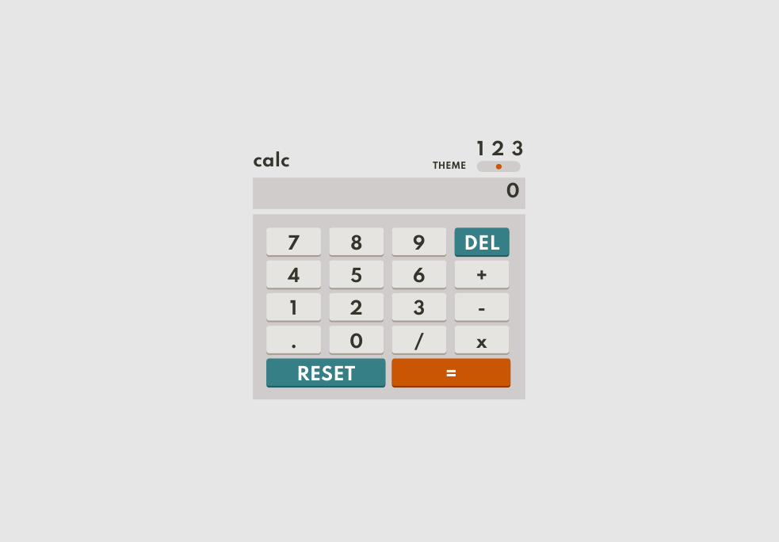
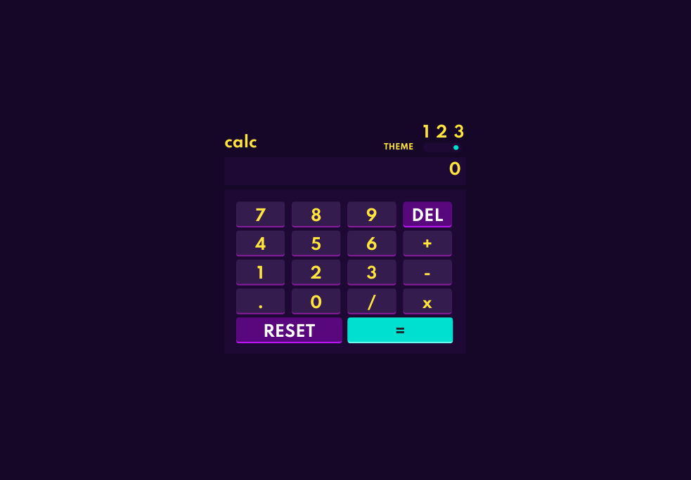

# Frontend Mentor - Calculator app solution

This is a solution to the [Calculator app challenge on Frontend Mentor](https://www.frontendmentor.io/challenges/calculator-app-9lteq5N29). Frontend Mentor challenges help you improve your coding skills by building realistic projects.

## Table of contents

- [Overview](#overview)
  - [The challenge](#the-challenge)
  - [Screenshot](#screenshot)
- [My process](#my-process)
  - [Built with](#built-with)
  - [What I learned](#what-i-learned)
  - [Continued development](#continued-development)
  - [Useful resources](#useful-resources)

## Overview

### The challenge

Users should be able to:

- See the size of the elements adjust based on their device's screen size
- Perform mathmatical operations like addition, subtraction, multiplication, and division
- Adjust the color theme based on their preference
- **Bonus**: Have their initial theme preference checked using `prefers-color-scheme` and have any additional changes saved in the browser

### Screenshot

## My process

### Built with

- Semantic HTML5 markup
- CSS custom properties
- Flexbox
- CSS Grid

### What I learned

- opacity is the right way to hide things that still need to be interactable
- use toLocaleString() to get commas

### Continued development

- For proper calculator, need variables for lastPressedKey, displayNumber, operator
- Add visual indication for key press
- Edge Cases
- Instead of eval, push key pressed to an evaluation array that is parsed with regex
- No live link since this used eval
- Have to limit display length 

### Useful resources

- [Stack Overflow](https://stackoverflow.com/questions/23661970/3-state-css-toggle-switch)
- [Stack Overflow](https://stackoverflow.com/questions/6479236/calculate-string-value-in-javascript-not-using-eval)
- [Stack Overflow](https://stackoverflow.com/questions/1423777/how-can-i-check-whether-a-radio-button-is-selected-with-javascript)
- [Stack Overflow](https://stackoverflow.com/questions/25793716/how-to-change-style-of-radio-and-checkbox-input)
- [MDN Docs](https://developer.mozilla.org/en-US/docs/Web/JavaScript/Reference/Global_Objects/eval#never_use_eval!) - eval()
- [Medium](https://medium.com/@wbl.pauline/how-to-build-a-calculator-using-javascript-no-more-than-100-lines-of-js-code-b9bd087a14e8) - basic calculator
- [Stack Overflow](https://stackoverflow.com/questions/32292231/how-to-code-a-calculator-in-javascript-without-eval) - avoiding eval
- [Log Rocket](https://blog.logrocket.com/css-transitions-101-lets-animate-a-toggle-button-icon-333967f5b971/) - toggle buttons
- [Blog](https://zellwk.com/blog/calculator-part-1/) - Calculator tutorial
- [Geeks for Geeks](https://www.geeksforgeeks.org/nested-switch-case/) - Nested Switch Case
